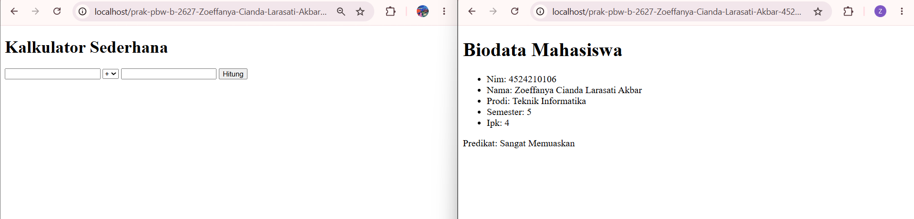
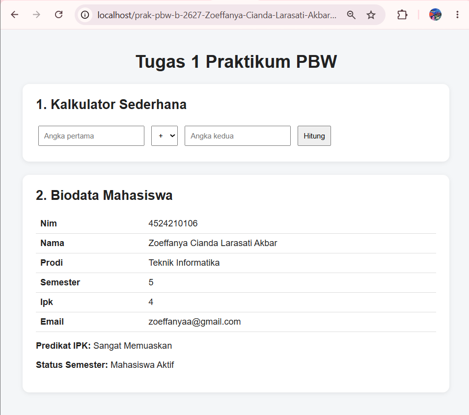

# **TUGAS 1 PRAKTIKUM PBW**

## **1. Menjalankan Contoh Pertemuan 1**

Pada Tugas 1 ini saya menjalankan contoh program dari Pertemuan 1, yaitu:

contoh1.php untuk program kalkulator sederhana.

contoh2.php untuk program biodata mahasiswa.

Kedua program sudah berhasil dijalankan menggunakan XAMPP dan browser melalui localhost dan menghasilkan output tanpa error kritis.

## **2. Modifikasi Program**

Saya melakukan beberapa modifikasi pada program yang sudah diberikan.

### **Modifikasi 1: Menambahkan Validasi pada Kalkulator**

Pada program kalkulator saya menambahkan validasi input. Program akan mengecek apakah kedua angka sudah diisi dan apakah input yang diberikan berupa angka.

Selain itu, program juga memberikan pesan jika pengguna mencoba melakukan pembagian dengan angka 0.

if ($a === '' || $b === '') {
    $pesan = 'Kedua angka wajib diisi.';
} elseif (!is_numeric($a) || !is_numeric($b)) {
    $pesan = 'Input harus berupa angka.';
}

Modifikasi ini dibuat supaya program tidak langsung memproses input yang tidak sesuai.

### **Modifikasi 2: Menambahkan Field pada Biodata**

Pada data biodata mahasiswa saya menambahkan field baru, yaitu email.

Saya juga menambahkan fungsi statusSemester() untuk menentukan status mahasiswa berdasarkan semester. Jika semester berada pada rentang 1 sampai 6, maka program menampilkan Mahasiswa Aktif.

Dengan modifikasi ini, informasi yang ditampilkan pada biodata menjadi lebih lengkap.

Modifikasi Tambahan: Styling

Saya juga menambahkan CSS sederhana pada halaman agar tampilan kalkulator dan biodata lebih rapi. Beberapa perubahan yang dilakukan yaitu membuat tampilan berbentuk card, tabel biodata, mengatur jarak antar elemen, dan memperbaiki tampilan form.

## **3. Lima Bagian Kode yang Penting**

### **1. Pengecekan Metode POST**

if (($_SERVER['REQUEST_METHOD'] ?? '') === 'POST')

Bagian ini digunakan untuk mengecek apakah form dikirim menggunakan metode POST.

### **2. Validasi Input**

if ($a === '' || $b === '') {
    $pesan = 'Kedua angka wajib diisi.';
}

Bagian ini digunakan untuk mengecek input pada kalkulator agar tidak kosong.

### **3. Percabangan switch**

switch ($operator) {
    case '+':
        $hasil = $a + $b;
        break;
}

switch digunakan untuk menentukan operasi berdasarkan operator yang dipilih.

### **4. Fungsi statusKelulusan()**

function statusKelulusan(float $ipk): string

Fungsi ini digunakan untuk menentukan predikat mahasiswa berdasarkan IPK.

### **5. Fungsi statusSemester()**

function statusSemester(int $semester): string

Fungsi ini digunakan untuk menentukan status mahasiswa berdasarkan semester.

## **4. Screenshot Sebelum dan Sesudah Modifikasi**

Screenshot Sebelum Modifikasi

Screenshot berikut menunjukkan tampilan program sebelum dilakukan modifikasi.

Screenshot Sesudah Modifikasi

Screenshot berikut menunjukkan tampilan program setelah dilakukan modifikasi.

## **5. Error yang Pernah Muncul**

Saat mencoba menjalankan contoh1.php melalui terminal dengan perintah:

C:\xampp\php\php.exe contoh1.php

muncul warning:

Warning: Undefined array key "REQUEST_METHOD"

Penyebab

Error tersebut muncul karena file dijalankan langsung melalui PHP CLI atau terminal. Pada kondisi tersebut, $_SERVER['REQUEST_METHOD'] tidak tersedia seperti ketika program dijalankan melalui web server.

Perbaikan

Saya kemudian menjalankan program menggunakan XAMPP dengan Apache dan membukanya melalui browser menggunakan localhost.

Pada file Tugas1.php, pengecekan juga dibuat lebih aman dengan:

($_SERVER['REQUEST_METHOD'] ?? '') === 'POST'

Dengan begitu, program tidak menghasilkan warning ketika REQUEST_METHOD belum tersedia.

### **Kesimpulan**

Pada Tugas 1 ini saya sudah menjalankan contoh Pertemuan 1 dan melakukan beberapa modifikasi pada program. Modifikasi yang dilakukan yaitu menambahkan validasi pada kalkulator, menambahkan field email dan kondisi status semester pada biodata, serta memperbaiki tampilan menggunakan CSS.

Dari tugas ini saya jadi lebih memahami penggunaan kondisi, fungsi, form POST, validasi input, dan dasar styling pada program PHP.