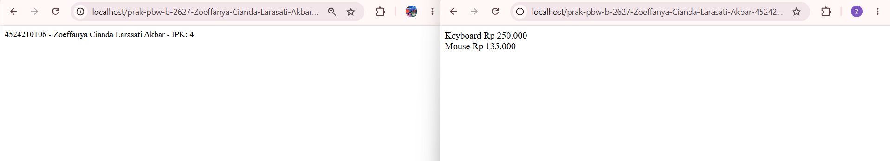
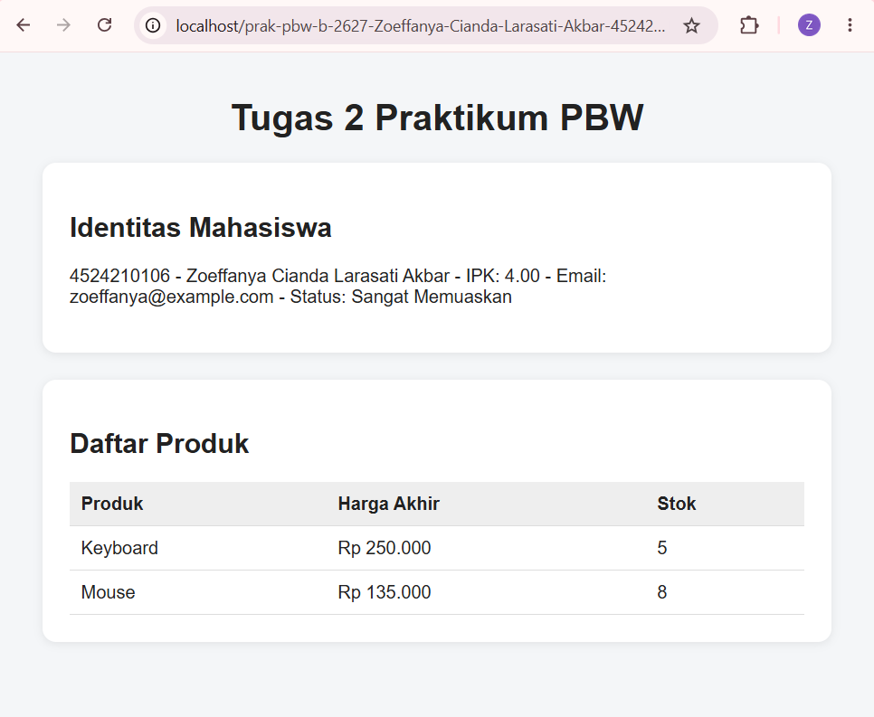

# Tugas 2 Praktikum PBW

## **1. Menjalankan Contoh Pertemuan 2**

Pada Tugas 2 ini saya menjalankan contoh program dari Pertemuan 2, yaitu:

contoh3.php untuk contoh interface dan class Mahasiswa.

contoh4.php untuk contoh interface, inheritance, dan polymorphism pada class Produk.

Kedua program sudah dijalankan menggunakan XAMPP dan browser melalui localhost dan menghasilkan output tanpa error kritis.

## **2. Modifikasi Program**

Saya melakukan beberapa modifikasi pada program Pertemuan 2 agar program memiliki fungsi tambahan dan validasi.

### **Modifikasi 1: Menambahkan Email dan Validasi pada Class Mahasiswa**

Pada class Mahasiswa saya menambahkan property baru yaitu email.

Email juga diberikan validasi menggunakan filter_var() agar data yang dimasukkan harus memiliki format email yang benar.

Dengan adanya modifikasi ini, data mahasiswa yang ditampilkan menjadi lebih lengkap dan input yang tidak sesuai dapat ditolak.

### **Modifikasi 2: Menambahkan Status Berdasarkan IPK**

Saya menambahkan method getStatus() pada class Mahasiswa.

Method tersebut digunakan untuk menentukan status berdasarkan nilai IPK:

IPK 3.50 atau lebih → Sangat Memuaskan

IPK 3.00 sampai kurang dari 3.50 → Memuaskan

IPK di bawah 3.00 → Perlu Peningkatan

Modifikasi ini menambahkan kondisi baru pada program.

### **Modifikasi Tambahan: Stok dan Validasi Produk**

Pada class Produk saya menambahkan property stok. Saya juga menambahkan validasi untuk harga dan stok agar nilainya tidak boleh negatif.

Pada class ProdukDiskon, nilai diskon juga divalidasi agar berada pada rentang 0 sampai 100 persen.

Selain itu, tampilan hasil produk dibuat lebih rapi menggunakan tabel dan CSS sederhana.

## **3. Lima Bagian Kode yang Penting**

### **1. Interface Identitas**

interface Identitas
{
    public function ringkasan(): string;
}

Interface digunakan sebagai aturan bahwa class yang menggunakannya harus memiliki method ringkasan().

### **2. Class Mahasiswa**

class Mahasiswa implements Identitas

Class Mahasiswa digunakan untuk membuat object mahasiswa dan mengimplementasikan interface Identitas.

### **3. Constructor**

public function __construct(string $nim, string $nama, float $ipk)

Constructor digunakan untuk memberikan nilai awal pada object ketika object Mahasiswa dibuat.

### **4. Inheritance pada ProdukDiskon**

class ProdukDiskon extends Produk

Bagian ini menunjukkan inheritance, yaitu ProdukDiskon mewarisi property dan method dari class Produk.

### **5. Method hargaAkhir()**

public function hargaAkhir(): float

Method ini digunakan untuk menghitung harga akhir produk. Pada ProdukDiskon, method tersebut dioverride sehingga harga akhir dapat dihitung setelah diskon.

## **4. Screenshot Sebelum dan Sesudah Modifikasi**

Screenshot Sebelum Modifikasi

Screenshot berikut menunjukkan output contoh program Pertemuan 2 sebelum dilakukan modifikasi.

Screenshot Sesudah Modifikasi

Screenshot berikut menunjukkan output program setelah dilakukan modifikasi.

## **5. Error yang Pernah Muncul**

Pada saat menjalankan program, nilai IPK harus berada pada rentang 0 sampai 4.

Pada class Mahasiswa, terdapat validasi:

if ($ipk < 0 || $ipk > 4) {
    throw new InvalidArgumentException('IPK harus 0 sampai 4.');
}

Penyebab

Validasi tersebut akan menghasilkan exception jika nilai IPK yang diberikan berada di luar rentang 0 sampai 4.

Perbaikan

Nilai IPK kemudian diberikan dengan nilai yang sesuai, yaitu berada pada rentang 0 sampai 4. Pada program yang digunakan, nilai IPK yang dimasukkan adalah 4.00, sehingga program dapat dijalankan dengan normal.

### **Kesimpulan**

Pada Tugas 2 ini saya sudah menjalankan contoh Pertemuan 2 dan melakukan beberapa modifikasi pada program. Modifikasi yang dilakukan yaitu menambahkan email dan validasi pada class Mahasiswa, menambahkan status berdasarkan IPK, serta menambahkan stok dan validasi pada data produk.

Dari tugas ini saya jadi lebih memahami penggunaan class, object, interface, constructor, inheritance, polymorphism, method, dan validasi pada PHP OOP.