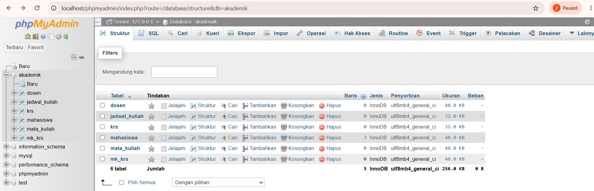
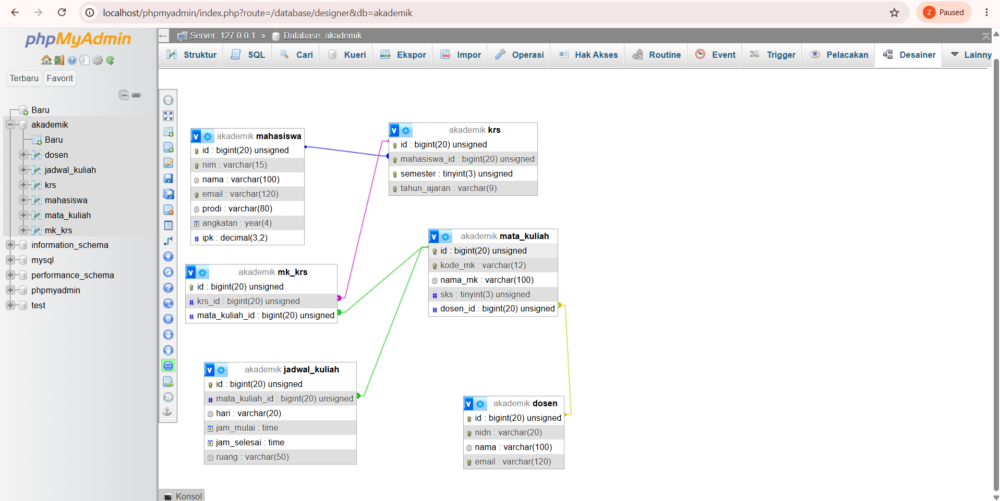

**# **TUGAS PRAKTIKUM PBW PERTEMUAN 3****

**## **1. Menjalankan Contoh Pertemuan 3****

Pada Tugas Pertemuan 3 ini saya menjalankan contoh program dari Pertemuan 3, yaitu:

contoh1.php untuk membuat database dan beberapa tabel pada database akademik.

contoh2.php untuk membuat database serta tabel mahasiswa, dosen, mata kuliah, KRS, dan detail KRS.

Pada tugas ini, modifikasi dilakukan pada program contoh2.php.

Program dijalankan menggunakan XAMPP dengan Apache dan MySQL yang aktif melalui localhost.

**## **2. Modifikasi Program****

Saya melakukan beberapa modifikasi pada program contoh2.php yang sudah diberikan.

**### **Modifikasi 1: Menambahkan Tabel Jadwal Kuliah****

Pada program tugas3.php saya menambahkan tabel baru yaitu jadwal_kuliah.

Tabel ini digunakan untuk menyimpan informasi jadwal mata kuliah, seperti mata kuliah, hari, jam mulai, jam selesai, dan ruang.

Bagian kode yang ditambahkan yaitu:

php
"CREATE TABLE IF NOT EXISTS jadwal_kuliah (
    id BIGINT UNSIGNED AUTO_INCREMENT PRIMARY KEY,
    mata_kuliah_id BIGINT UNSIGNED NOT NULL,
    hari VARCHAR(20) NOT NULL,
    jam_mulai TIME NOT NULL,
    jam_selesai TIME NOT NULL,
    ruang VARCHAR(50) NOT NULL,

    CONSTRAINT fk_jadwal_mata_kuliah
        FOREIGN KEY (mata_kuliah_id)
        REFERENCES mata_kuliah(id)
        ON UPDATE CASCADE
        ON DELETE CASCADE
) ENGINE=InnoDB"

 Tabel jadwal_kuliah memiliki foreign key yang terhubung dengan tabel mata_kuliah. Dengan begitu, data jadwal dapat dikaitkan dengan mata kuliah yang tersedia.

### Modifikasi 2: Menampilkan Jumlah Tabel

Saya menambahkan query untuk menghitung jumlah tabel yang terdapat pada database akademik.

Kode yang ditambahkan yaitu:

$sqlCountTables = "SELECT COUNT(*) AS jumlah_tabel
                   FROM information_schema.tables
                   WHERE table_schema = 'akademik'";

Kemudian hasilnya ditampilkan menggunakan:

echo "\nJumlah tabel dalam database akademik: "
    . $dataTabel['jumlah_tabel'] . "\n";

Dengan modifikasi ini, program tidak hanya membuat database dan tabel, tetapi juga dapat menampilkan jumlah tabel yang terdapat pada database akademik.

## 3. Lima Bagian Kode yang Penting

### 1. Memanggil File Koneksi

require_once 'koneksi.php';

Bagian ini digunakan untuk memanggil file koneksi agar program dapat terhubung dengan server MySQL.

### 2. Membuat Database

$sqlCreateDB = "CREATE DATABASE IF NOT EXISTS akademik";

Query ini digunakan untuk membuat database dengan nama akademik. Penggunaan IF NOT EXISTS membuat database tidak dibuat ulang apabila database tersebut sudah tersedia.

### 3. Memilih Database

mysqli_select_db($koneksi, "akademik");

Bagian ini digunakan untuk memilih database akademik yang akan digunakan dalam proses pembuatan tabel.

### 4. Membuat Tabel dengan CREATE TABLE

"CREATE TABLE IF NOT EXISTS mahasiswa (
    id BIGINT UNSIGNED AUTO_INCREMENT PRIMARY KEY,
    nim VARCHAR(15) NOT NULL UNIQUE,
    nama VARCHAR(100) NOT NULL,
    email VARCHAR(120) NOT NULL UNIQUE,
    prodi VARCHAR(80) NOT NULL,
    angkatan YEAR NOT NULL,
    ipk DECIMAL(3,2) DEFAULT 0.00
) ENGINE=InnoDB"

Bagian ini digunakan untuk membuat tabel mahasiswa beserta kolom, tipe data, dan aturan yang digunakan pada setiap kolom.

### 5. Menjalankan Query dengan mysqli_query()

if (mysqli_query($koneksi, $query)) {
    echo "Tabel berhasil dibuat atau sudah ada.\n";
}

mysqli_query() digunakan untuk menjalankan query SQL melalui koneksi MySQL. Jika query berhasil dijalankan, program akan menampilkan pesan bahwa tabel berhasil dibuat atau sudah tersedia.

## 4. Screenshot Sebelum dan Sesudah Modifikasi

Screenshot Sebelum Modifikasi

Screenshot berikut menunjukkan hasil program contoh2.php sebelum dilakukan modifikasi.

Screenshot Sesudah Modifikasi

Screenshot berikut menunjukkan hasil program contoh2.php di tugas3.php setelah dilakukan modifikasi.

## 5. Error yang Pernah Muncul

Bagian ini disesuaikan dengan error yang benar-benar muncul saat proses pengerjaan.

Saat menjalankan program, apabila terdapat error dari PHP atau MySQL, saya mengecek pesan error yang ditampilkan untuk mengetahui bagian kode yang bermasalah.

Penyebab

Penyebab error dapat diketahui dari pesan yang diberikan oleh PHP atau MySQL. Setelah mengetahui bagian yang bermasalah, saya memeriksa kembali query, koneksi database, atau sintaks kode yang digunakan.

Perbaikan

Saya memperbaiki bagian kode yang menyebabkan error kemudian menjalankan program kembali melalui XAMPP dan browser menggunakan localhost untuk memastikan program dapat berjalan dengan baik.

### Kesimpulan

Pada Tugas Praktikum PBW Pertemuan 3 ini saya sudah menjalankan contoh program yang diberikan dan melakukan modifikasi pada contoh2.php.

Modifikasi yang dilakukan yaitu menambahkan tabel jadwal_kuliah yang berhubungan dengan tabel mata_kuliah serta menambahkan proses untuk menghitung jumlah tabel yang terdapat pada database akademik.

Dari tugas ini saya menjadi lebih memahami cara membuat database dan tabel menggunakan PHP dan MySQL, penggunaan foreign key untuk menghubungkan tabel, serta cara menjalankan query MySQL melalui PHP.