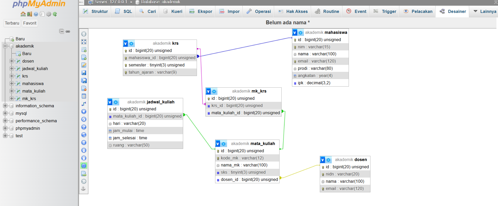
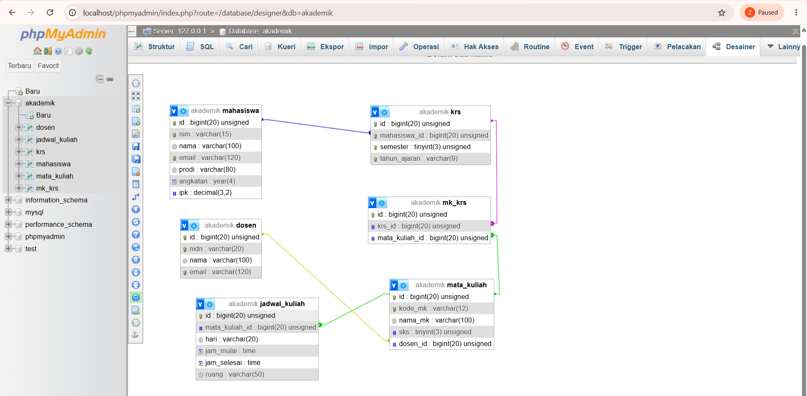

**# **TUGAS PRAKTIKUM PBW PERTEMUAN 4****

**## **1. Menjalankan Contoh Pertemuan 4****

Pada Tugas Pertemuan 4 ini saya menjalankan contoh program dari Pertemuan 4, yaitu:

contoh1.php untuk melakukan proses INSERT dan SELECT data mahasiswa.

contoh2.php untuk melakukan proses UPDATE, SELECT, GROUP BY, verifikasi data, dan DELETE pada tabel mahasiswa.

Kedua program dijalankan menggunakan XAMPP dengan Apache dan MySQL yang aktif melalui localhost.

Pada tugas ini saya melakukan modifikasi pada contoh1.php dan contoh2.php.

**## **2. Modifikasi Program****

Saya melakukan beberapa modifikasi pada program yang sudah diberikan.

**### **Modifikasi 1 pada contoh1.php di tugas4_1.php : Menambahkan Status IPK****

Pada tugas4_1.php saya menambahkan kondisi untuk menentukan status IPK mahasiswa berdasarkan nilai IPK.

Jika IPK mahasiswa 3.75 atau lebih, maka status yang ditampilkan adalah "Sangat Baik". Jika IPK 3.50 atau lebih, maka statusnya "Baik". Selain itu status yang ditampilkan adalah "Cukup".

Bagian kode yang ditambahkan yaitu:

php
if ($row['ipk'] >= 3.75) {
    $statusIpk = "Sangat Baik";
} elseif ($row['ipk'] >= 3.50) {
    $statusIpk = "Baik";
} else {
    $statusIpk = "Cukup";
}

Kemudian status tersebut ditampilkan bersama data mahasiswa.

Modifikasi ini dibuat supaya hasil SELECT tidak hanya menampilkan data mahasiswa, tetapi juga memberikan informasi tambahan berdasarkan nilai IPK.

### Modifikasi 2 pada contoh1.php di tugas4_1.php : Menghitung Jumlah Mahasiswa

Saya menambahkan query COUNT(*) untuk menghitung jumlah mahasiswa yang mempunyai IPK minimal 3.50.

Kode yang ditambahkan yaitu:

$sqlCount = "SELECT COUNT(*) AS jumlah
             FROM mahasiswa
             WHERE ipk >= 3.50";

Hasil jumlah mahasiswa kemudian ditampilkan pada output program.

Dengan modifikasi ini, program dapat memberikan informasi jumlah mahasiswa yang memenuhi kriteria IPK tertentu.

### Modifikasi 3 pada contoh2.php di tugas4_2.php : Menambahkan Status Setelah UPDATE

Pada tugas4_2.php saya menambahkan pengecekan IPK setelah proses UPDATE.

Program akan mengambil kembali data IPK mahasiswa dengan NIM 2025003. Jika IPK minimal 3.50, program menampilkan status "Baik". Jika kurang dari 3.50, program menampilkan "Perlu ditingkatkan".

Kode yang ditambahkan yaitu:

if ($dataIpk['ipk'] >= 3.50) {
    echo "Status IPK: Baik.\n\n";
} else {
    echo "Status IPK: Perlu ditingkatkan.\n\n";
}

Modifikasi ini membuat hasil proses UPDATE menjadi lebih informatif karena program tidak hanya mengubah data, tetapi juga memberikan informasi berdasarkan IPK terbaru.

### Modifikasi 4 pada contoh2.php di tugas4_2.php: Menambahkan Total Mahasiswa

Pada bagian rekap jumlah mahasiswa berdasarkan prodi, saya menambahkan proses untuk menghitung total seluruh mahasiswa.

Kode yang digunakan yaitu:

$totalMahasiswa = 0;

while ($row = mysqli_fetch_assoc($resultRekap)) {
    $totalMahasiswa += $row['jumlah_mahasiswa'];
}

Setelah seluruh data prodi diproses, program menampilkan jumlah total mahasiswa.

Dengan modifikasi ini, hasil rekap menjadi lebih lengkap karena tidak hanya menampilkan jumlah mahasiswa setiap prodi, tetapi juga jumlah keseluruhan mahasiswa.

## 3. Lima Bagian Kode yang Penting

### 1. Proses INSERT

$sqlInsert = "INSERT IGNORE INTO mahasiswa (nim, nama, email, prodi, angkatan, ipk) VALUES
('2026001', 'Andi Pratama', 'andi@kampus.ac.id', 'Teknik Informatika', 2026, 3.75),
('2026002', 'Siti Rahma', 'siti@kampus.ac.id', 'Sistem Informasi', 2026, 3.82),
('2026003', 'Budi Santoso', 'budi@kampus.ac.id', 'Teknik Informatika', 2026, 3.20)";

Bagian ini digunakan untuk memasukkan beberapa data mahasiswa ke dalam tabel mahasiswa.

**### 2. Query SELECT dengan WHERE

$sqlSelect = "SELECT nim, nama, prodi, ipk
              FROM mahasiswa
              WHERE ipk >= 3.50
              ORDER BY ipk DESC, nama ASC
              LIMIT 10";

Query ini digunakan untuk mengambil data mahasiswa dengan IPK minimal 3.50. Data kemudian diurutkan berdasarkan IPK secara menurun dan nama secara menaik.

### 3. Proses UPDATE

$sqlUpdate = "UPDATE mahasiswa SET ipk = 3.40 WHERE nim = '2025003'";

Bagian ini digunakan untuk mengubah nilai IPK mahasiswa berdasarkan NIM tertentu.

### 4. GROUP BY dan COUNT

$sqlRekap = "SELECT prodi, COUNT(*) AS jumlah_mahasiswa
             FROM mahasiswa
             GROUP BY prodi
             ORDER BY jumlah_mahasiswa DESC";

Query ini digunakan untuk mengelompokkan data mahasiswa berdasarkan prodi dan menghitung jumlah mahasiswa pada setiap prodi.

### 5. Proses DELETE

$sqlDelete = "DELETE FROM mahasiswa WHERE nim = '2025003'";

Bagian ini digunakan untuk menghapus data mahasiswa berdasarkan NIM tertentu setelah data tersebut diverifikasi terlebih dahulu.

## 4. Screenshot Sebelum dan Sesudah Modifikasi

**### Screenshot Sebelum Modifikasi

Screenshot berikut menunjukkan hasil program sebelum dilakukan modifikasi pada contoh1.php dan contoh2.php.

**### Screenshot Sesudah Modifikasi

Screenshot berikut menunjukkan hasil program setelah dilakukan modifikasi pada contoh1.php dan contoh2.php.

## 5. Error yang Pernah Muncul

Bagian ini disesuaikan dengan error yang benar-benar muncul saat proses pengerjaan.

Saat menjalankan program, apabila terdapat error PHP atau MySQL, saya mengecek pesan error yang ditampilkan untuk mengetahui bagian kode yang bermasalah.

Penyebab

Penyebab error dapat diketahui dari pesan yang diberikan oleh PHP atau MySQL. Saya kemudian memeriksa kembali query SQL, koneksi database, nama tabel, dan sintaks PHP yang digunakan.

Perbaikan

Saya memperbaiki bagian kode yang menyebabkan error kemudian menjalankan program kembali melalui XAMPP dan browser menggunakan localhost untuk memastikan program dapat berjalan dengan baik.

### Kesimpulan

Pada Tugas Praktikum PBW Pertemuan 4 ini saya sudah menjalankan contoh1.php dan contoh2.php kemudian melakukan beberapa modifikasi pada kedua program tersebut.

Pada contoh1.php saya menambahkan status IPK dan menghitung jumlah mahasiswa yang memenuhi kriteria IPK. Pada contoh2.php saya menambahkan status setelah proses UPDATE dan menghitung total seluruh mahasiswa pada proses rekap data.

Dari tugas ini saya menjadi lebih memahami penggunaan query INSERT, SELECT, UPDATE, GROUP BY, COUNT, dan DELETE menggunakan PHP dan MySQL. Saya juga menjadi lebih memahami bagaimana hasil query dapat diolah kembali menggunakan kondisi dan perulangan dalam PHP.